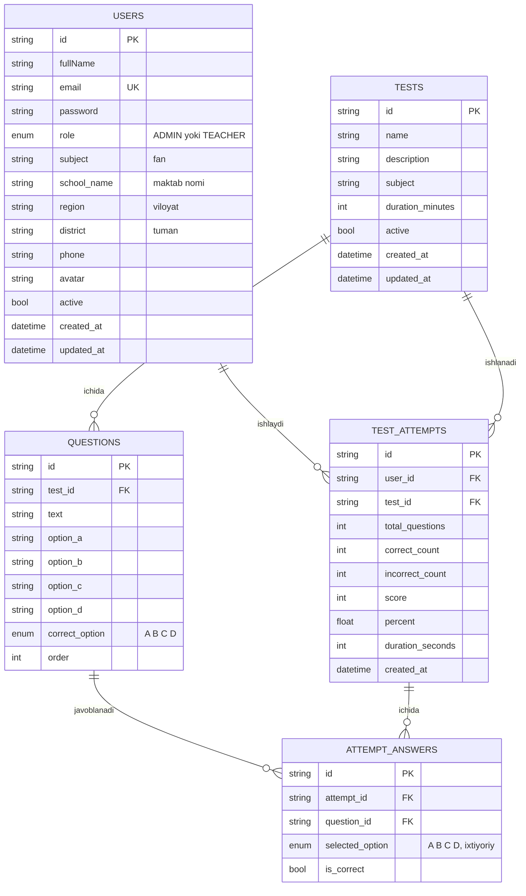

# EduTest — Backend API

O'qituvchilar uchun onlayn test platformasi. REST API.

Node.js + TypeScript, [Ts.ED](https://tsed.io) (Express ustida), PostgreSQL va Prisma ORM.
Validation uchun Zod, autentifikatsiya uchun JWT.

---

## Mundarija

- [Texnologiyalar](#texnologiyalar)
- [Talablar](#talablar)
- [Ishga tushirish](#ishga-tushirish)
- [Environment o'zgaruvchilari](#environment-ozgaruvchilari)
- [Papka strukturasi](#papka-strukturasi)
- [Ma'lumotlar bazasi](#malumotlar-bazasi)
- [Autentifikatsiya va rollar](#autentifikatsiya-va-rollar)
- [API hujjatlari](#api-hujjatlari)
- [Endpointlar](#endpointlar)
- [Qidiruv, sorting va pagination](#qidiruv-sorting-va-pagination)
- [Javob formati va xatoliklar](#javob-formati-va-xatoliklar)
- [Arxitektura qarorlari](#arxitektura-qarorlari)

---

## Texnologiyalar

| Qatlam     | Texnologiya                    |
| ---------- | ------------------------------ |
| Runtime    | Node.js 20+, TypeScript 5      |
| Framework  | Ts.ED 8 (Express 5 adapter)    |
| Database   | PostgreSQL 14+                 |
| ORM        | Prisma 6                       |
| Validation | Zod 3                          |
| Auth       | JWT (`jsonwebtoken`) + bcrypt  |
| Docs       | Swagger UI (OpenAPI 3.0.3)     |
| Security   | helmet, cors, hpp, compression |

---

## Talablar

- Node.js **20 yoki undan yuqori**
- PostgreSQL **14 yoki undan yuqori**
- yarn (yoki npm)

---

## Ishga tushirish

```bash
# 1. Repository'ni klonlash
git clone <repository-url>
cd api

# 2. Paketlarni o'rnatish (postinstall avtomatik `prisma generate` ishlatadi)
yarn install

# 3. Environment faylini tayyorlash
cp .env.sample .env
#    .env ichida DATABASE_URL va JWT_SECRET ni to'ldiring

# 4. Bazani yaratish va migration'larni qo'llash
yarn db:migrate

# 5. Boshlang'ich ma'lumotlar (admin + demo o'qituvchi + testlar)
yarn db:seed

# 6. Dev serverni ishga tushirish
yarn dev
```

Server: **http://localhost:9100**
Swagger: **http://localhost:9100/docs**

### Seed hisoblari

| Email               | Parol         | Rol                                               |
| ------------------- | ------------- | ------------------------------------------------- |
| `admin@edutest.uz`  | `password123` | ADMIN — testlar yaratadi/tahrirlaydi              |
| `malika@edutest.uz` | `password123` | TEACHER — testlarni ishlaydi, natijalarni ko'radi |

> Bu hisoblar faqat lokal ishlab chiqish uchun. Production'da `yarn db:seed` ishlatmang
> yoki parollarni darhol almashtiring.

### Foydali skriptlar

| Skript            | Vazifasi                                        |
| ----------------- | ----------------------------------------------- |
| `yarn dev`        | Dev server (nodemon + ts-node)                  |
| `yarn build`      | TypeScript'ni `dist/` ga kompilyatsiya qilish   |
| `yarn start:prod` | Kompilyatsiya qilingan build'ni ishga tushirish |
| `yarn typecheck`  | Type xatolarini tekshirish (kod yozmaydi)       |
| `yarn db:migrate` | Yangi migration yaratish va qo'llash            |
| `yarn db:deploy`  | Mavjud migration'larni qo'llash (production)    |
| `yarn db:seed`    | Boshlang'ich ma'lumotlarni yuklash              |
| `yarn db:reset`   | Bazani o'chirib, qaytadan migrate + seed qilish |
| `yarn db:studio`  | Prisma Studio (baza uchun GUI)                  |

---

## Environment o'zgaruvchilari

Barchasi `.env.sample` da namuna sifatida keltirilgan.

| O'zgaruvchi       | Majburiy | Default        | Izoh                                              |
| ----------------- | -------- | -------------- | ------------------------------------------------- |
| `DATABASE_URL`    | ✅       | —              | PostgreSQL ulanish satri                          |
| `JWT_SECRET`      | ✅       | —              | Token imzolash kaliti (uzun, tasodifiy)           |
| `JWT_EXPIRES_IN`  | —        | `1d`           | Token amal qilish muddati (`15m`, `12h`, `7d`)    |
| `PORT`            | —        | `9100` (local) | Server porti                                      |
| `STAGE`           | —        | `local`        | `local` \| `testing` \| `production`              |
| `NODE_ENV`        | —        | `development`  | `development` \| `production`                     |
| `CORS_ORIGIN`     | —        | `*`            | Vergul bilan ajratilgan ruxsat etilgan origin'lar |
| `SWAGGER_ENABLED` | —        | `true`         | `false` bo'lsa `/docs` o'chiriladi                |
| `SWAGGER_PATH`    | —        | `/docs`        | Swagger UI manzili                                |

`DATABASE_URL` yoki `JWT_SECRET` bo'lmasa, ilova **ishga tushmaydi va aniq xato beradi** —
bu `undefined` kalit bilan token imzolashning oldini oladi.

---

## Papka strukturasi

```
api/
├── config/              # Stage bo'yicha konfiguratsiya (local / testing / prod)
├── controllers/         # HTTP qatlami — route, decorator, biznes-logika yo'q
│   ├── auth.controller.ts
│   ├── test.controller.ts
│   ├── result.controller.ts
│   ├── dashboard.controller.ts
│   └── health.controller.ts
├── services/            # Biznes-logika, validation chaqiruvi, baza bilan ishlash
│   ├── auth.service.ts
│   ├── test.service.ts
│   ├── result.service.ts
│   ├── dashboard.service.ts
│   └── token.service.ts       # logout uchun token denylist
├── inputs/              # Zod sxemalari — barcha kiruvchi ma'lumot shu yerda tekshiriladi
├── middlewares/
│   ├── auth.middleware.ts     # JWT tekshirish + rol nazorati
│   ├── error.middleware.ts    # Global error handling (yagona nuqta)
│   ├── logging.middleware.ts
│   └── 404.middleware.ts
├── modules/             # Barcha qatlamlar tayanadigan quyi qatlam
│   ├── auth.ts                # autentifikatsiya: JWT, bcrypt
│   ├── db.ts                  # prisma client
│   ├── nanoid.ts
│   └── declarations.ts        # global tiplar
├── utils/               # Yordamchi funksiyalar va konstantalar
├── prisma/
│   ├── schema.prisma
│   ├── migrations/      # SQL migration fayllari
│   └── seed.ts
├── generated/           # Prisma client + Zod tiplari (git'da yo'q, generatsiya qilinadi)
├── index.ts             # Kirish nuqtasi
└── server.ts            # Platforma konfiguratsiyasi, middleware'lar, Swagger
```

**Qatlamlar ajratilgan:** controller faqat so'rovni qabul qiladi va service'ga uzatadi;
service biznes-qoidalarni bajaradi; input sxemalari validation'ni ushlab turadi;
xatoliklar bitta global filter orqali javobga aylanadi.

---

## Ma'lumotlar bazasi

### ER diagramma



### Bog'lanishlar va o'chirish qoidalari

| Bog'lanish                    | Qoida                                                           |
| ----------------------------- | --------------------------------------------------------------- |
| Test → Questions              | `onDelete: Cascade` — test o'chsa, savollari ham o'chadi        |
| Test → TestAttempts           | `onDelete: Cascade` — test o'chsa, natijalar ham o'chadi        |
| User → TestAttempts           | `onDelete: Cascade` — o'qituvchi o'chsa, natijalari ham o'chadi |
| TestAttempts → AttemptAnswers | `onDelete: Cascade` — natija o'chsa, javoblari ham o'chadi      |

### Migration fayllari

Bazani noldan qurish uchun: `yarn db:migrate` (yoki production'da `yarn db:deploy`).

---

## Autentifikatsiya va rollar

JWT **Bearer token** orqali:

```http
Authorization: Bearer <accessToken>
```

### Kirish oqimi

Login **faqat token** qaytaradi — foydalanuvchi ma'lumoti alohida endpointdan olinadi:

```http
POST /api/auth/signin
{ "email": "malika@edutest.uz", "password": "password123" }

→ { "success": true,
    "data": { "accessToken": "eyJhbGci...", "tokenType": "Bearer", "expiresIn": 86400 } }
```

```http
GET /api/auth/me

→ { "success": true,
    "data": {
      "id": "...", "fullName": "Malika Abduvaliyeva", "email": "...",
      "role": "TEACHER", "subject": "Matematika", "school_name": "...",
      "region": "...", "district": "...", "phone": "...",
      "isAdmin": false, "active": true } }
```

### Ikki rol

| Rol         | Huquqi                                                                                                               |
| ----------- | -------------------------------------------------------------------------------------------------------------------- |
| **TEACHER** | Ro'yxatdan o'tadi, profilini boshqaradi, testlar ro'yxatini ko'radi, testni ishlaydi, o'z natijalarini ko'radi       |
| **ADMIN**   | TEACHER huquqlariga qo'shimcha — test yaratish/tahrirlash/o'chirish va barcha o'qituvchilarning natijalarini ko'rish |

Bo'sh bazada ro'yxatdan o'tgan **birinchi foydalanuvchi ADMIN** bo'ladi, qolganlari TEACHER.

**Muhim tafsilotlar:**

- Har bir so'rovda foydalanuvchi **bazadan qayta o'qiladi** — token ichidagi ma'lumotga
  ishonilmaydi. Hisob bloklansa, bu **darhol** kuchga kiradi.
- `POST /api/auth/logout` tokenni bekor qiladi (`jti` denylist orqali).
- Parol o'zgartirilganda joriy token avtomatik bekor qilinadi.
- Parollar `bcrypt` bilan (10 rounds) saqlanadi va **hech qachon** javobga tushmaydi.
- Test savollarining to'g'ri javobi (`correct_option`) TEACHER'ga hech qachon
  `GET /tests/:id` orqali ko'rsatilmaydi — faqat ADMIN'ga (tahrirlash uchun) va
  test topshirilgandan keyin `GET /results/:id` orqali ko'rinadi.

---

## API hujjatlari

**Swagger UI** — server ishlab turganda: <http://localhost:9100/docs>
Yuqoridagi **Authorize** tugmasiga tokenni kiritsangiz, barcha himoyalangan
endpointlarni to'g'ridan-to'g'ri brauzerdan sinab ko'rasiz.

---

## Endpointlar

Barcha manzillar `/api` prefiksi bilan.

### Auth

| Metod | Manzil                  | Ruxsat | Vazifasi                                                           |
| ----- | ----------------------- | ------ | ------------------------------------------------------------------ |
| POST  | `/auth/signup`          | Ochiq  | Ro'yxatdan o'tish → token                                          |
| POST  | `/auth/signin`          | Ochiq  | Kirish → token                                                     |
| POST  | `/auth/logout`          | Auth   | Joriy tokenni bekor qilish                                         |
| GET   | `/auth/me`              | Auth   | Profil ma'lumotlari                                                |
| PUT   | `/auth/me`              | Auth   | Profilni tahrirlash (F.I.Sh, fan, maktab, viloyat, tuman, telefon) |
| POST  | `/auth/update-password` | Auth   | Parolni almashtirish                                               |

### Tests

| Metod  | Manzil              | Ruxsat    | Vazifasi                                                    |
| ------ | ------------------- | --------- | ----------------------------------------------------------- |
| GET    | `/tests`            | Auth      | Testlar ro'yxati (qidiruv + pagination), faqat faol testlar |
| GET    | `/tests/:id`        | Auth      | Bitta test + savollari (to'g'ri javobsiz)                   |
| POST   | `/tests`            | **Admin** | Test yaratish (savollari bilan birga)                       |
| PUT    | `/tests/:id`        | **Admin** | Testni tahrirlash                                           |
| DELETE | `/tests/:id`        | **Admin** | Testni o'chirish (cascade)                                  |
| POST   | `/tests/:id/submit` | Auth      | Javoblarni yuborish → natija hisoblanadi va saqlanadi       |

`POST /tests` body:

```json
{
  "name": "Matematika test 1",
  "subject": "Matematika",
  "description": "Chiziqli tenglamalar",
  "duration_minutes": 30,
  "questions": [
    {
      "text": "2x + 5 = 15 tenglamani yeching",
      "option_a": "x = 5",
      "option_b": "x = 7",
      "option_c": "x = 10",
      "option_d": "x = 15",
      "correct_option": "A"
    }
  ]
}
```

`POST /tests/:id/submit` body:

```json
{
  "answers": [{ "question_id": "cl123...", "selected_option": "B" }],
  "duration_seconds": 1240
}
```

→ javobda to'g'ri/noto'g'ri javoblar soni, ball va foiz qaytadi.

### Results (Natijalar)

| Metod | Manzil         | Ruxsat                  | Vazifasi                                                                            |
| ----- | -------------- | ----------------------- | ----------------------------------------------------------------------------------- |
| GET   | `/results`     | Auth                    | O'z natijalari ro'yxati (Admin uchun — barchasi)                                    |
| GET   | `/results/:id` | Auth (egasi yoki Admin) | Bitta natija — har bir savol bo'yicha to'g'ri/noto'g'ri javob ("Xatolarni ko'rish") |

### Dashboard

| Metod | Manzil             | Ruxsat | Vazifasi                                                                   |
| ----- | ------------------ | ------ | -------------------------------------------------------------------------- |
| GET   | `/dashboard/stats` | Auth   | Jami testlar, ishlangan testlar, o'rtacha natija, oxirgi ishlangan testlar |

`GET /api/dashboard/stats` javobi:

```json
{
  "success": true,
  "data": {
    "totalTests": 5,
    "completedTests": 2,
    "averageScore": 90,
    "bestScore": 100,
    "recentAttempts": [
      {
        "id": "...",
        "percent": 100,
        "score": 4,
        "total_questions": 4,
        "created_at": "...",
        "test": { "id": "...", "name": "Fizika test 2", "subject": "Fizika" }
      }
    ]
  }
}
```

---

## Qidiruv, sorting va pagination

`GET /tests` va `GET /results` bir xil query parametrlarni qabul qiladi.

| Parametr                              | Default           | Izoh                                                   |
| ------------------------------------- | ----------------- | ------------------------------------------------------ |
| `page`                                | `1`               | Sahifa raqami                                          |
| `size`                                | `10`              | Sahifadagi yozuvlar soni                               |
| `search`                              | —                 | Test nomi/fan/tavsif bo'yicha qidiruv (faqat `/tests`) |
| `sortBy[0][key]` / `sortBy[0][order]` | `created_at desc` | Saralash                                               |

```
GET /api/tests?search=matematika&page=1&size=10
GET /api/results?sortBy[0][key]=percent&sortBy[0][order]=desc
```

Javob shakli:

```json
{ "success": true, "data": { "items": [], "count": 42 } }
```

---

## Javob formati va xatoliklar

**Muvaffaqiyat:**

```json
{ "success": true, "data": {}, "_message": "saqlandi" }
```

**Xato:**

```json
{
  "success": false,
  "_message": "Validation failed",
  "errors": [{ "field": "email", "message": "Invalid email" }]
}
```

### Status kodlar

| Kod   | Qachon                                                                                   |
| ----- | ---------------------------------------------------------------------------------------- |
| `400` | Validation xatosi, biznes-qoida buzilishi                                                |
| `401` | Token yo'q, yaroqsiz, muddati o'tgan yoki bekor qilingan                                 |
| `403` | Autentifikatsiyadan o'tgan, lekin ruxsat yo'q (masalan, TEACHER test yaratmoqchi bo'lsa) |
| `404` | Resurs topilmadi                                                                         |
| `409` | Unique cheklov buzildi (masalan, email band)                                             |
| `500` | Kutilmagan xato (`stack` faqat development'da)                                           |

Xatolarni javobga aylantirish **faqat bitta joyda** — `middlewares/error.middleware.ts`
ichidagi `GlobalErrorFilter` da bajariladi. Zod, Prisma (`P2002`, `P2003`, `P2025`)
va Ts.ED exception'larini tanib, mos status va tushunarli xabar qaytaradi.

---

## Arxitektura qarorlari

**Nega Ts.ED?**
Decorator'ga asoslangan controller/service tuzilishi (NestJS'ga o'xshash), DI konteyner qutidan chiqadi, lekin ostida oddiy Express turadi.

**Validation qayerda?**
Zod sxemalari `inputs/` da, `parse()` esa **service ichida** chaqiriladi. Shu sababli
biznes-logika hech qachon tekshirilmagan ma'lumot ko'rmaydi.

**Natija qanday hisoblanadi?**
`TestService.submit` test savollarini bazadan o'qiydi (klient yuborgan emas), har bir
savol uchun yuborilgan javobni to'g'ri javob bilan solishtiradi va natijani bitta
yozuvda (`TestAttempts`) hamda har bir savol bo'yicha (`AttemptAnswers`) saqlaydi —
shu orqali keyinchalik "Xatolarni ko'rish" ekrani uchun to'liq tafsilot mavjud bo'ladi.

**Nega logout uchun denylist?**
Imzolangan JWT muddati tugagunga qadar yaroqli. `TokenService` token `jti` sini
muddati tugagunga qadar xotirada saqlaydi. Bitta instansiya uchun to'g'ri; bir nechta
replica bo'lsa, Redis'ga (`SETEX jti <ttl> 1`) ko'chirish kerak.

**Xavfsizlik choralari**

- `helmet` — xavfsizlik header'lari
- `hpp` — HTTP Parameter Pollution himoyasi
- `cors` — `.env` orqali origin allow-list
- `json({ limit: '1mb' })` — katta payload orqali DoS'ning oldini olish
- Prisma parametrlangan so'rovlar — SQL injection yo'q
- Xato xabarlari email mavjudligini oshkor qilmaydi (account enumeration himoyasi)
- Production'da `stack` javobga qo'shilmaydi
